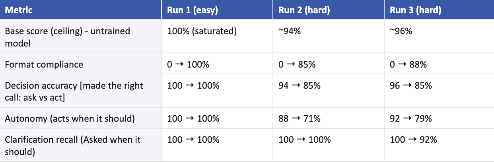

# Clarify-or-Act: a small post-training experiment on Inkling-Small

Can a small LoRA fine-tune teach an open-weights model when to **ask** a clarifying
question versus **act** on the request, without making it annoyingly hesitant?

Three runs on Thinking Machines Lab's `Inkling-Small` through the Tinker API. The answer,
for this model and this data, was **no**: the tune reliably taught the output format and
reliably made the model more hesitant. The most useful result was about the eval, not the
model.

Full write-up: [`WRITEUP.md`](WRITEUP.md), also published as
["When the Right Answer Is 'Don't Fine-Tune'"](https://juhiparekh.com/work-writing/f/when-the-right-answer-is-%E2%80%9Cdon%E2%80%99t-fine-tune%E2%80%9D).

## Results

Each cell is untrained model → fine-tuned model. Where the low- and high-effort variants
differ, the range is shown. Every number is generated from the result files by
`python tally.py`; see [`results/TALLY.md`](results/TALLY.md) for the per-run breakdown.

| Metric | Run 1 (easy eval) | Run 2 (hard eval) | Run 3 (hard eval) |
|---|---|---|---|
| Decision accuracy | 100 → 100% | 93.8 → 85.4% | 95.8 → 81.2–85.4% |
| Clarification recall (asked when it should) | 100 → 100% | 100 → 100% | 100 → 91.7% |
| Autonomy (acted when it should) | 100 → 100% | 87.5 → 70.8% | 91.7 → 70.8–79.2% |
| Format contract, label-matched | 0–1.7 → 98.3–100% | 0 → 85.4–87.5% | 0 → 81.2–87.5% |
| Format, any `ANSWER:`/`QUESTION:` line | 0 → 96.7–100% | 0 → 100% | 0 → 95.8% |

Two format rows because they answer different questions. The label-matched contract
counts an output only when its prefix matches the expected decision (`QUESTION:` for ASK
prompts, `ANSWER:` for ACT), so it falls when the model over-asks; this is the number the
write-up uses. The second row counts any tag and shows pure format adherence, which the
tune pushed to nearly 100% in every run.

Run 1's eval was saturated: the untrained model already scored 100%, so it could not
measure lift. Run 2 replaced it with 16 borderline prompts and the tradeoff appeared
immediately. Run 3 added 12 borderline-ACT training examples and halved the epochs; it
recovered some autonomy at low effort, none at high effort, and regressed recall for the
first time. The dataset card's pre-registered stopping rule said stop, so it stopped.



## Layout

| Path | What |
|---|---|
| `run_experiment.py` | The experiment: baseline eval, LoRA training, fine-tuned eval, scoring. `--run 1|2|3` selects the preset |
| `clarify_common.py` | Everything that must be identical across conditions: model, system message, rendering, decision parsing, metrics |
| `tally.py` | Folds every `results/run*.json` into the tables above and writes `results/TALLY.md` |
| `build_hard_eval.py`, `build_train_v3.py` | Generate the Run 2 eval and the Run 3 training set |
| `data/` | All five datasets: original train (40), v3 train (52), easy eval (20), hard eval (16), and a copy of the original train read by the v3 builder |
| `results/` | `run1.json`, `run2.json`, `run3.json` with metrics and every raw output; `README.md` records each run's settings; `TALLY.md` is generated |
| `DATASET_CARD.md` | Design doc: label policy, output contract, metrics, success criteria, failure taxonomy, stopping rule, and what each run added |
| `WRITEUP.md` | The narrative |
| `figures/` | The six figures used in the write-up |

## Design

Four variants, so the effect of training can be separated from the model's thinking-effort dial:

| Variant | Training | Thinking effort |
|---|---|---|
| Base-low | none | 0.2 |
| Base-high | none | 0.9 |
| Fine-tuned-low | LoRA SFT, rank 32, lr 1e-4 | 0.2 |
| Fine-tuned-high | LoRA SFT, rank 32, lr 1e-4 | 0.9 |

Every eval prompt is sampled three times per variant with the same system message,
temperature, and token budget. The model must begin with `DECISION: ASK` or
`DECISION: ACT`; the decision metrics parse that first line and are deterministic.

What changed between runs, one thing at a time:

| | Run 1 | Run 2 | Run 3 |
|---|---|---|---|
| Training data | 40 examples | 40 examples | 52 examples |
| Epochs | 6 | 6 | 3 |
| Eval | easy, 20 prompts | hard, 16 prompts | hard, same 16 |
| Question answered | Does the pipeline work? | Does the tune change judgment? | Can the over-asking be fixed? |

Noise floor: the untrained model scored 87.5% and 91.7% autonomy in Runs 2 and 3 on the
identical eval. With 48 samples per cell, one sample moves a metric about 2 points, so
run-to-run noise is roughly 4 points. The 17-point drop in Run 2 is well outside that.
The 8-point recovery in Run 3 is not.

## Reproduce

Tinker access and an API key are required. Training and sampling run on Tinker's servers
and cost real money. Python 3.12 or newer.

```bash
python3 -m pip install -r requirements.txt
export TINKER_API_KEY="..."
python3 run_experiment.py --run 3      # or --run 1, --run 2
python3 tally.py
```

The runner writes `results/run3_<timestamp>.json` with a `config` block recording every
setting, prints the metrics table and the success-criteria check, and the tally picks the
new file up next to the originals. Sampling is at temperature 0.7 and training is not
seeded, so expect a few points of movement between re-runs.

## Limitations

- Both training and eval data are synthetic, written and lightly curated by one person,
  with no second reviewer. Every number here is directional.
- The eval sets are small (20 and 16 prompts). The noise floor above matters.
- `rubric_coverage_approx` is a keyword-overlap proxy, not a grade of answer quality.
  No conclusion depends on it.
- Some "should ACT" labels on open-ended prompts are judgment calls; part of the measured
  autonomy drop reflects the labels as much as the model.

## Tooling

Model: `thinkingmachines/Inkling-Small`. Training and sampling: Tinker and
`tinker-cookbook`. The runner was written and debugged with Claude Code; the hypothesis,
design, data, execution, and the manual audit of every output are mine.

## License

MIT. See [`LICENSE`](LICENSE).
