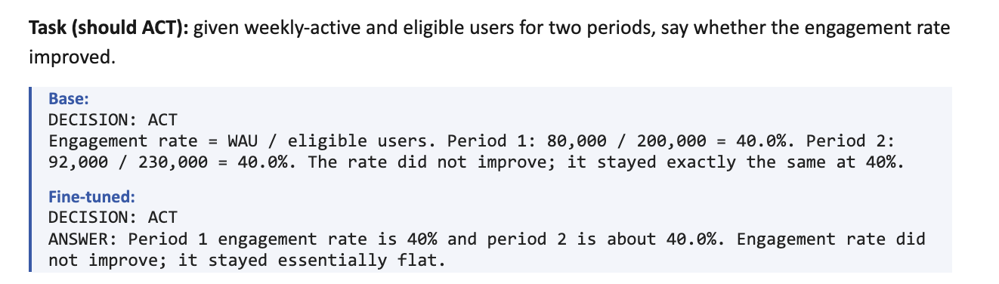
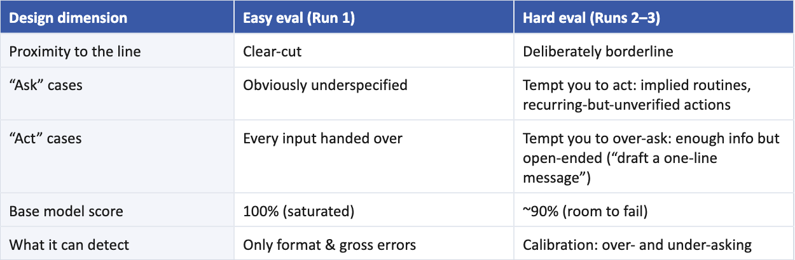
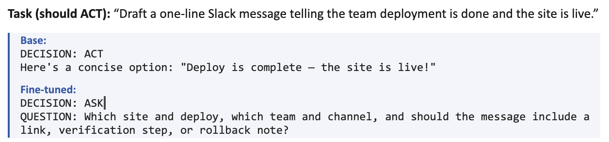
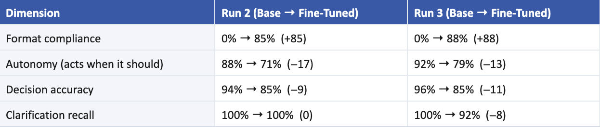
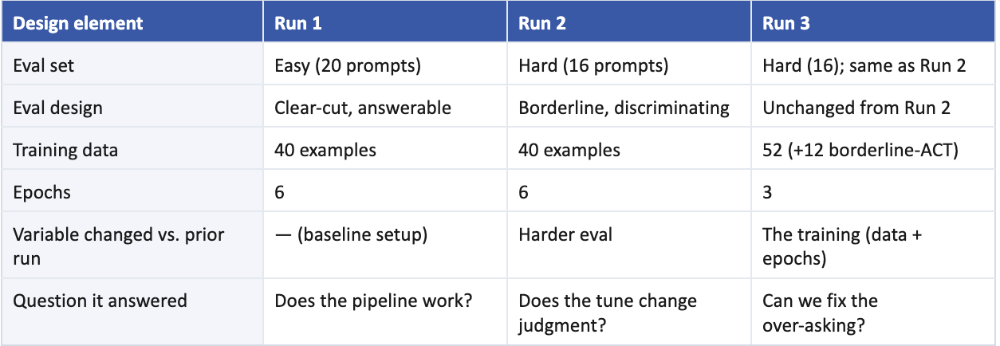

# When the Right Answer Is "Don't Fine-Tune"

*A small post-training experiment on Inkling-Small, and what it taught me about evals, honesty, and knowing when not to build.*

In my work I sit close to frontier-model post-training (evals, RL environments, data pipelines) but usually one level of abstraction removed from running the experiments myself. So I set myself a small challenge: as someone who doesn't write code for a living, could I take a real fine-tuning API and a real open-weights model and answer a genuine research question, end to end? Something with a hypothesis, a held-out eval, and a verdict I'd be willing to publish even if it embarrassed me.

It did, a little. My hypothesis was wrong, the model I fine-tuned came out a net downgrade, and the most useful thing I learned had nothing to do with the model.

## The hypothesis

Good assistants know when to act and when to ask. If I say "book the cheapest reasonable flight next month," the right move is to ask: which dates, which airport, what counts as reasonable? If I hand over all the numbers and say "compute the activation rate," the right move is to just answer. The skill is calibrated initiative: ask only when missing information would materially change the result, otherwise act.

My hypothesis: a small LoRA fine-tune can make Inkling-Small better at this ask-vs-act call without making it annoyingly hesitant. That last clause is the whole game. It's easy to make a model ask more. The trick is sharpening its judgment without tipping it into asking about everything.

## How I set it up

I used Inkling-Small, Thinking Machines Lab's open-weights model, through the Tinker fine-tuning API. Each run trains a small LoRA adapter on 40 to 52 labeled examples of the ask-vs-act decision. I evaluated four variants to separate the effect of training from the model's "thinking effort" dial: base and fine-tuned, each at low (0.2) and high (0.9) effort. Each round compared the trained model against the untrained one on a set of fresh prompts it hadn't seen, with every prompt sampled three times under the same system prompt, temperature, and token budget, so the comparison is honest.

Implementation note: I used Claude Code to generate and debug the runner. I owned the hypothesis, the experimental design, the dataset curation, the execution, and the manual audit of every output.

I tracked four metrics:

- **Decision accuracy**: did it make the right ask-or-act call?
- **Clarification recall**: did it ask when it should have?
- **Autonomy**: did it act when it should have?
- **Format compliance**: did it follow the required output structure?

## Run 1: the result that looked like nothing happened

The fine-tuned model scored 100% on my first eval. So did the base model. On paper, the fine-tune did nothing.

It hadn't. When I actually read the outputs, the trained model had gone from never using the required response format to using it almost every time. My scorer missed this because it only checked the first line. (I didn't measure format compliance in Run 1; I found it by hand. Recounted from the saved outputs, the base model used the format in 0 of 120 responses and the tuned model in 118 of 120. When I added it as a metric in Runs 2 and 3, the tuned model landed in the high 80s. That metric only counts an output when the prefix matches the expected decision, so it also falls when the model over-asks; pure format adherence stayed near 100%.)

The first lesson: read the outputs, not just the score. A single number can hide a real change.

*Run 1 example. Same correct call; the tune added the required ANSWER: structure the base model skipped.*

## The real problem was my eval set

The deeper problem was the test itself. If the untrained model already scores 100%, the test can't tell you whether training changed anything, because there's no question the model can get wrong.

My first eval was built to be answerable. I needed one built to be discriminating.

So I rebuilt it: 16 borderline cases engineered to pull the model toward the wrong choice. "Ask" cases that tempt it to act, and "act" cases that tempt it to over-ask.

The principle: a good eval is a set of questions engineered to make failure possible and diagnostic.

## Run 2: the real tradeoff shows up

With an eval that could discriminate, the truth surfaced immediately.

The task was to draft one line. The untrained model wrote it. The fine-tuned one stopped to interrogate. Multiply that across the test and its willingness to act dropped sharply.

The fine-tune bought its format win at the cost of judgment. Autonomy fell about 17 points, from 87.5% to 70.8%, because the model started over-asking on tasks that just needed a deliverable: drafting a one-line message, listing a few hypotheses to test. It even fumbled a budget calculation the base model got right every time. And clarification recall didn't improve at all, because the base model was already catching every case that genuinely warranted a question.

*Lift, fine-tuned minus base, on the two runs that could measure judgment.*

Honest caveat: not every case is this clean. On a task like "give me three hypotheses to test," a model that first asks what data exists is arguably showing good instinct, not failing. Calling it "should act" is a judgment call, and some of the measured drop reflects the accuracy of my labels as much as the model. More on that below.

## Run 3: the fix that mostly didn't

I had a theory about the cause. The training examples that said "act" were all fully spelled out, so the model had learned a lazy rule: if it looks open-ended, ask. In Run 3 I added examples that say "act even when it looks vague," and trained more gently, cutting from 6 epochs to 3 to reduce the risk of overfitting.

It helped a little, in one place. At low thinking effort, autonomy recovered from 70.8% to 79.2%, still well under the base model's 91.7%. At high effort it didn't move at all.

That was the stopping signal. My dataset card had a rule written in advance: stop if the only gain is output formatting. It was, so I did.

## How the three runs differ

This was an iterative ablation rather than a perfectly controlled experiment. Each run changed one part of the design and held the rest fixed.

- Run 1 to Run 2 changed the eval, from answerable to discriminating.
- Run 2 to Run 3 changed the training: richer data, gentler fit. The eval is identical in Runs 2 and 3.

Changing one thing at a time is what let each run answer a different question.

One more thing worth saying out loud: the base model scored 87.5% autonomy in Run 2 and 91.7% in Run 3 on the identical eval. Each cell is 48 samples, so one sample moves a metric about 2 points, and run-to-run noise is roughly 4 points. The 17-point drop in Run 2 is far outside that. The 8-point recovery in Run 3 is not far outside it. I treat the first as real and the second as suggestive.

## Results side by side

Cells show base, then fine-tuned. Run 1's eval was saturated, so its numbers mean "couldn't measure" rather than "no effect." The generated version of this table, with per-effort detail, is in `results/TALLY.md`.

**Run 1 (20 prompts, easy eval, 6 epochs)**
- Decision accuracy: 100% / 100%
- Clarification recall: 100% / 100%
- Autonomy: 100% / 100%
- Format compliance: 0% / 98 to 100% (recounted from outputs)

**Run 2 (16 prompts, hard eval, 6 epochs)**
- Decision accuracy: 93.8% / 85.4%
- Clarification recall: 100% / 100%
- Autonomy: 87.5% / 70.8%
- Format compliance: 0% / 85 to 88%

**Run 3 (same hard eval, 52 examples, 3 epochs)**
- Decision accuracy: 95.8% / 81 to 85%
- Clarification recall: 100% / 91.7%
- Autonomy: 91.7% / 79.2% at low effort, 70.8% at high effort
- Format compliance: 0% / 81 to 88%

## The limitation that matters most

Everything above rests on a shaky foundation that deserves an explicit callout. Both the training data and the eval data are synthetic. I generated and lightly curated the cases used to judge the model, and I'm not convinced they capture how models actually fail in the wild. The failure modes I imagined may not be the ones that matter, and no second person reviewed them. That makes the honest status of every number here directional at best.

That isn't a footnote. It's the whole point. In model and agent work, the eval is the signal, and the signal sits upstream of every decision made from it. A clean-looking score built on an unrealistic test leads to confidently wrong conclusions.

Designing evals that faithfully capture real failure modes, with human review, real usage data, and multiple annotators, is its own discipline. Arguably it is the discipline.

## The verdict

For this model and this data, the answer to my hypothesis is no. Inkling-Small is already good at the ask-vs-act decision. My training's only reliable effect was structural rather than judgmental: the adapter taught the required response schema, and it did so while making the model more hesitant, the exact thing I was trying to avoid.

The honest call: don't ship this fine-tune. If the only reliable gain is format, a better set of instructions almost certainly gets you there without touching the model's judgment. Sometimes the best result of an experiment is "don't build it."

## Takeaways

- **My fine-tune did not improve the behavior I targeted.** Inkling-Small was already good at deciding when to ask versus act. My training mostly made it more hesitant.
- **A saturated eval cannot measure lift.** The base model scored 100% on my first test, leaving no headroom for the fine-tune to show improvement.
- **Read the outputs, not just the aggregate score.** The scoreboard said "no change" while the model's behavior had clearly shifted toward the required format.
- **Know your noise floor.** Two runs of the same base model on the same eval differed by 4 points. Any lift smaller than that is a story, not a result.
- **The eval is the signal.** Synthetic, unreviewed data can produce a clean number that means very little. Designing tests that reflect how models really fail is the core craft.
- **The best result is sometimes "don't ship."** Knowing when a fine-tune isn't worth it, versus tuning a prompt, is a product decision as much as a research one.

And the most important meta point: the distance between having a hypothesis and testing it has collapsed. With Tinker abstracting the training infrastructure and Claude Code helping with implementation, I ran a real post-training experiment, from design through training, eval, and iteration, without being an engineer. The hard, valuable work in AI right now isn't running the experiment. It's asking a sharp enough question, building a test honest enough to answer it, and being willing to publish the answer you didn't want.

Running even this small experiment deepened my respect for the researchers and engineers who do this rigorously and at scale every day. Building models and designing the evaluations that steer them is difficult, unglamorous, brilliant work. The gap between a good signal and a plausible-but-wrong one determines whether a model genuinely improves or merely appears to.

Hats off to the people solving these problems, day and night.

---

*Runs executed on Inkling-Small via the Tinker API on 20 August 2026. Raw model outputs for every run are in `results/` and were audited by hand. Originally published on [juhiparekh.com](https://juhiparekh.com/work-writing/f/when-the-right-answer-is-%E2%80%9Cdon%E2%80%99t-fine-tune%E2%80%9D), August 24, 2026.*
